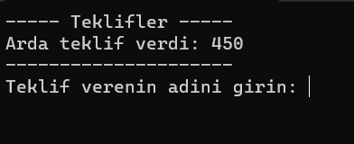
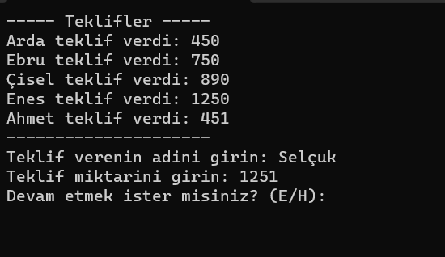
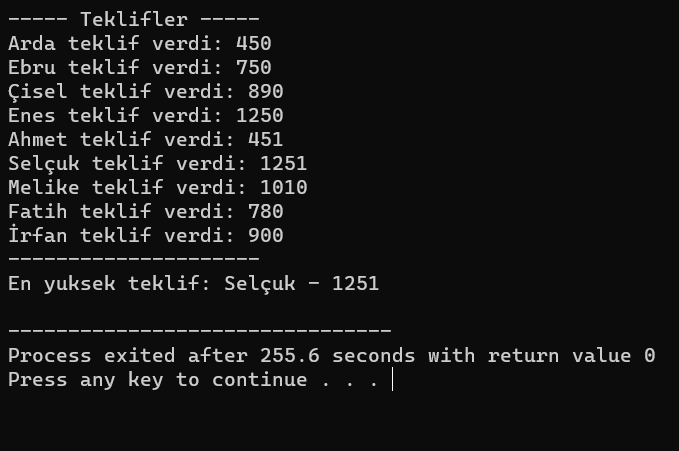

# Açık Arttırma Uygulaması
> Struct, Typedef, İşaretçi tanımı ve kullanımı 
<ul>
<li>Struct Nedir?</li>
Struct, C ve C++ gibi programlama dillerinde kullanılan bir veri yapısıdır. Struct içinde farklı türden verileri bir araya getirmek için kullanılır. Örneğin, teklif verenin ismi, teklif miktarı gibi farklı veri tiplerini içeren bir yapı oluşturabilirsiniz.

<li>Typedef Nedir?</li>
Typedef, mevcut veri tiplerine alternatif isimler atanmasını sağlayan bir C dilindeki bir özelliktir. Özellikle karmaşık veri tiplerinin isimlendirilmesini kolaylaştırarak kodun okunabilirliğini artırır.

<li>İşaretçiler (Pointers) Hakkında Kısa Bilgi:</li> 
İşaretçiler, bir değişkenin bellek adresini tutabilen özel veri tipleridir. Bu, fonksiyonlarda bellek kullanımını optimize etmek, dinamik bellek yönetimi sağlamak ve veri yapıları üzerinde etkili işlemler yapmak için kullanılır.

<li>Algoritma ve Struct, Typedef, İşaretçilerin Kullanımı:</li> 
Algoritmanın tasarımında struct ve typedef kullanmak, verileri düzenli bir şekilde gruplamak ve okunabilirliği artırmak için önemlidir. İşaretçiler, bellek kullanımını optimize etmek ve veri manipülasyonunu kolaylaştırmak için algoritmada kullanılabilir.

Örneğin, bir açık arttırma algoritması tasarlanırken, teklifin ve teklif verenin bilgilerini içeren bir struct kullanılabilir. Typedef ile bu yapıya daha anlamlı bir isim vererek kodun anlaşılabilirliğini artırabilirsiniz. İşaretçiler, algoritmada veriler arasında hızlı ve etkili bir şekilde gezinmek için kullanılabilir.

<li>Açık Arttırma ve Oyun Teorisi İlişkisi:</li> 
Açık arttırma, oyun teorisi kavramlarıyla ilişkilendirilebilir. Açık arttırmada, katılımcılar kendi stratejilerini kullanarak teklif verirler. Bu, oyun teorisinin strateji ve oyuncu davranışlarına odaklandığı bir alanı hatırlatır.

Oyun teorisi, karar verme süreçlerini ve stratejik etkileşimleri inceleyen bir disiplindir. Açık artırmalarda, katılımcılar arasındaki rekabet, kazanma stratejileri ve teklif stratejileri gibi kavramlar oyun teorisiyle ilişkilidir.

Bu iki alan arasındaki ilişki, katılımcıların kendi çıkarlarını en iyi şekilde koruma stratejilerini geliştirmelerini gerektirebilir. Ayrıca, açık artırmalarda yapılan stratejik kararlar, oyun teorisi modelleri ile analiz edilebilir.
</ul> 

> Uygulamaya ait çalışan uygulama kodları ve örnek ekran çıktıları
>

